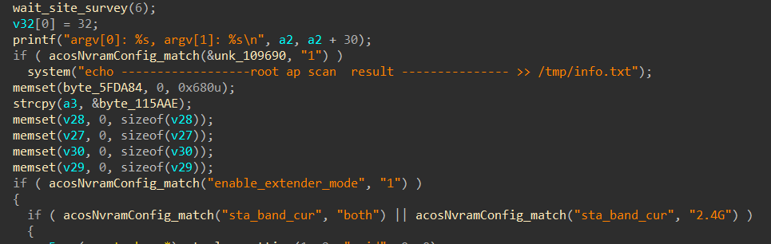
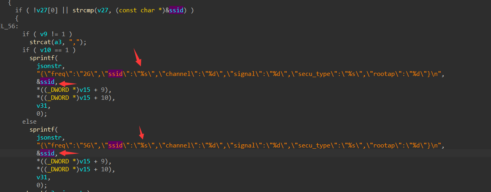
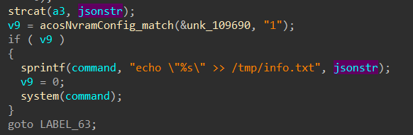
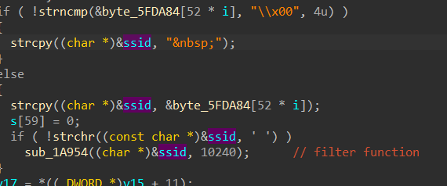
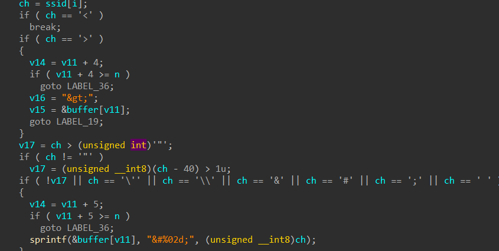
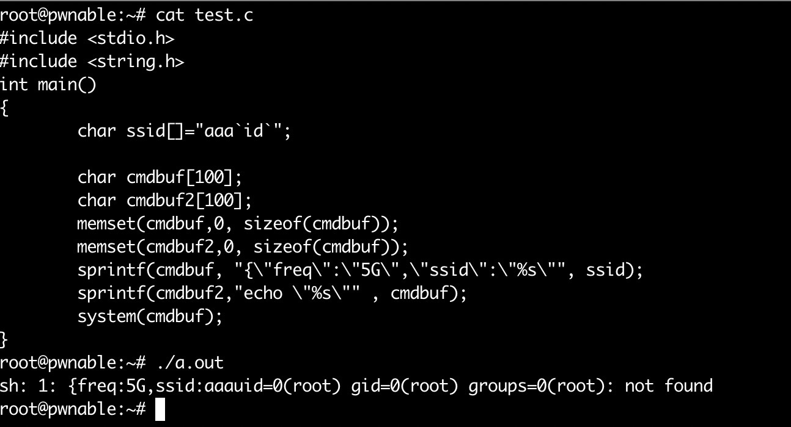
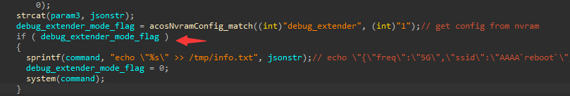

# Netgear R7000P command inject vulnerability

## Background

Netgear router R700P is built for gaming, streaming, and mobile devices, this router supports MU-MIMO for simultaneous streaming and delivers extreme speed and extended range. Includes NETGEAR Armor™ to provide advanced cyber threat protection for home and connected devices. Easily manage content and time online with Circle® Smart Parental Controls.

## Description

The router's `httpd` program is used to parse the HTTP requests. At the last version firmware([R7000P-V1.3.2.134_10.1.66](https://www.downloads.netgear.com/files/GDC/R7000P/R7000P-V1.3.2.134_10.1.66.zip))There is a function `sub_65694` is used to write logs:



This function is used to scan the nearby Wi-Fi and write the log to `/tmp/info.txt`. In this function, the Wi-Fi information scanned nearby will use `sprintf()` to write to a JSON string:



This JSON string will be written to another string, and use `system()` to execute it, caused the command to inject vulnerability:



Although there is a filter function to filter some characters include `space, ", \, \\, &, #`, we can still use backquote(``` ` ```) to bypass:




Here is a demo:



To trigger this function, we can use this js, but it needs the username and password:

```py
import requests

url = "http://192.168.1.1/WLG_opmode_scanresults_json.js"

header = {
    "Authorization": "Basic YWRtaW46MTIzNDU2" # base64(username + password)
}

requests.get(url=url, headers=header)
```

With some analysis and debugging, I found this `system()` function only called at `debug mode`(use `nvram set debug_extender=1` to open it), so this vulnerability is hard to exploit :)




## Affect Versions

Device: Netgear R7000P

Firmware: [R7000P-V1.3.2.134_10.1.66](https://www.downloads.netgear.com/files/GDC/R7000P/R7000P-V1.3.2.134_10.1.66.zip)
